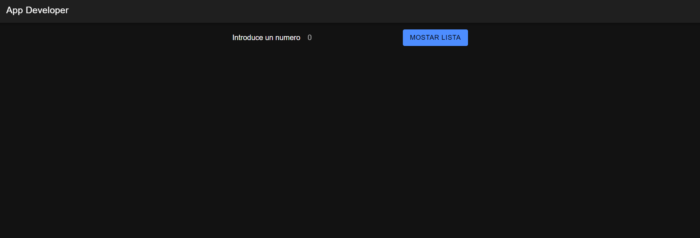

# Ejercicio app developer

## URL

https://ejercicio-app-developer.web.app/home
## Funcionamiento de la aplicacion

### Interfaz

### Validacion de input

Si se introduce un numero menor a 0 o decimal, se mostrara una alerta

### Introducir un numero valido

Una vez precionado el boton de mostrar lista, y validar correctamente el input pasan 2 cosas:
1. Se muestra la lista con de numeros de 0 al numero correspondiente, mostrando verde los multiplos de 3, rojo los de 5, y azul los de 7, ademas si el numero tiene mas de un multiplo muestra el color del menor multiplo, si no tiene multiplo de estos 3 numeros se muestra en negro

Ademas de esto, se incluyo la funcionalidad de que al hacer click en cualquiera de los numeros en algun color muestre cuales son sus multiplos correspondientes

2. En la base de datos se guarda informacion sobre el numero que se introdujo (number), y el resultado de que numero es multiplo de 3, 5, 7 (message)

## Consideraciones

- Es importante agregar metodos de seguridad (como app check), para evitar que la base de datos sea utilizada de una forma diference a la planeada, sin embargo por simplicidad esto no se agrego.